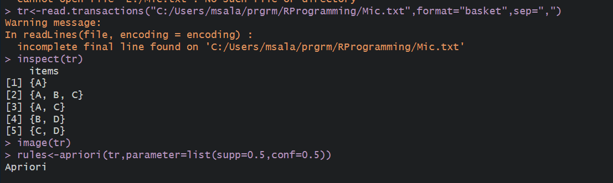
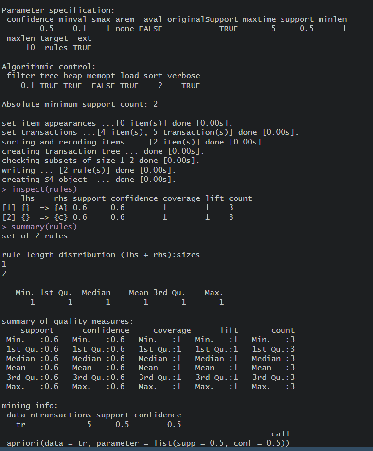
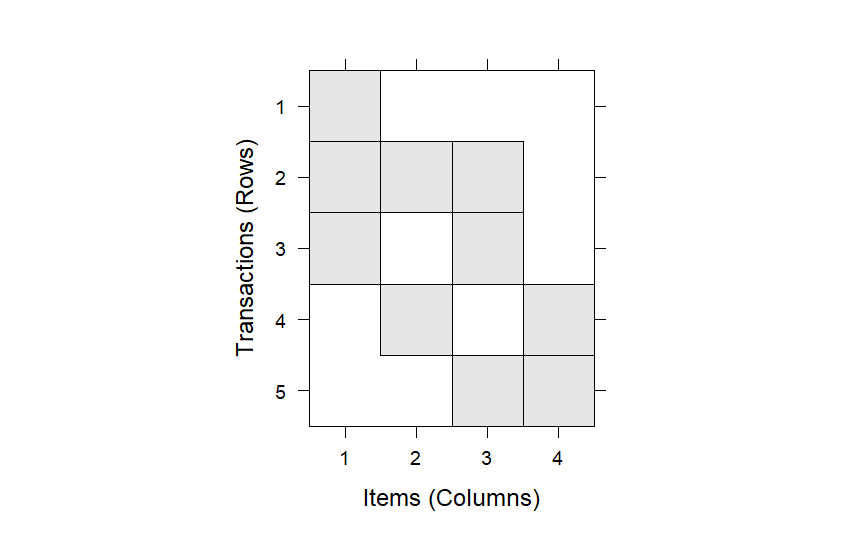

# APRIORI ALGORITHM

## Pre-requirements :
 * Need the [transaction file](./Mic.txt) before proceeding with  the execution.
 * Intall *__arules__* package

## Code :

To view code [click here](./APRIORI%20ALGORITHM.R)

## Algorithm :


```Algorithm
    step 1: Start the Process
    step 2: Select the cran mirror
    step 3: Install the package arules.
    step 4: Include the library Function of arules
    step 5: Inspect rules and summary the rules
    step 6: Stop the process
```

## Output :

### Console




### Plot Diagram



if the images didn't load then click to view Console [1](./output1.png) , [2](./output2.png) (click 1 then 2) 


To view Plot Diagram [click here](./Rplot.png)