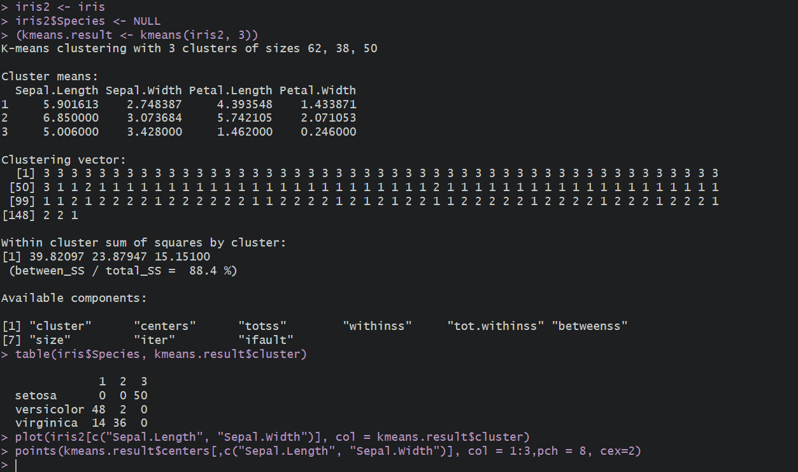
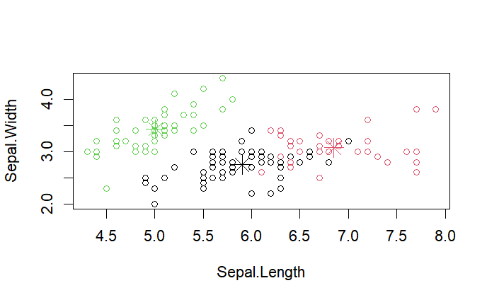

# K-MEANS CLUSTERING

## Pre-requirements :
 * No Pre-requirements

## Code :

To view code [click here](./K-MEANS%20CLUSTERING.R)

## Algorithm :


```Algorithm
    step 1: Start the Process
    step 2: Install the iris dataset 
    step 3: Display the items in the iris dataset
    step 4: Display the plot diagram of iris dataset
    step 5: Stop the process
```

## Output :

### Console



### Plot Diagram



if the images didn't load then [click here](./output.png) to view the Console 

To view Plot Diagram [click here](./Rplot.png)