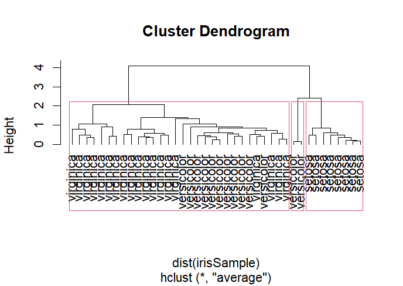

# HIERARCHAL CLUSTERING

## Pre-requirements :
 * No Pre-requirements

## Code :

To view code [click here](./HIERARCHAL%20CLUSTERING.R)

## Algorithm :


```Algorithm
    step 1: Start the Process
    step 2: Install the iris dataset 
    step 3: Specify the Species in the program
    step 4: Verify the output
    step 5: Stop the process
```

## Output :



if the images didn't load then [click here](./Rplot.png) to view the Output. 