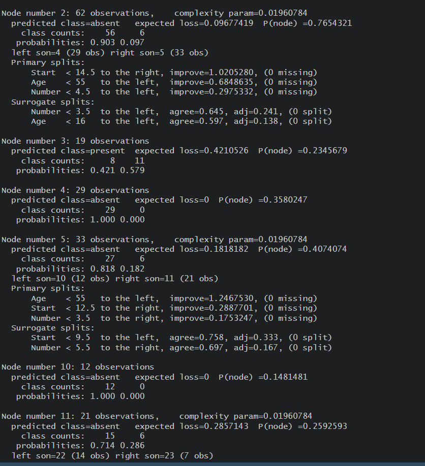

# CLASSIFICATION ALGORITHM

## Pre-requirements :
 * Intall *__rpart__* package
## Code :

To view code [click here](./CLASSIFICATION%20ALGORITHM.R)

## Algorithm :


```Algorithm
    step 1: Start the Process
    step 2: Install the iris dataset 
    step 3: Set the plot in Decision tree based classification
    step 4: Verify the output
    step 5: Stop the process
```

## Output :

### Console





### Plot Diagram


if the images didn't load then click to view Console [1](./output1.png) , [2](./output2.png) , [3](./output3.png) ( click 1 ,2 then 3)  

To view Plot Diagram click [1](./Rplot01.png) , [2](./Rplot02.png)