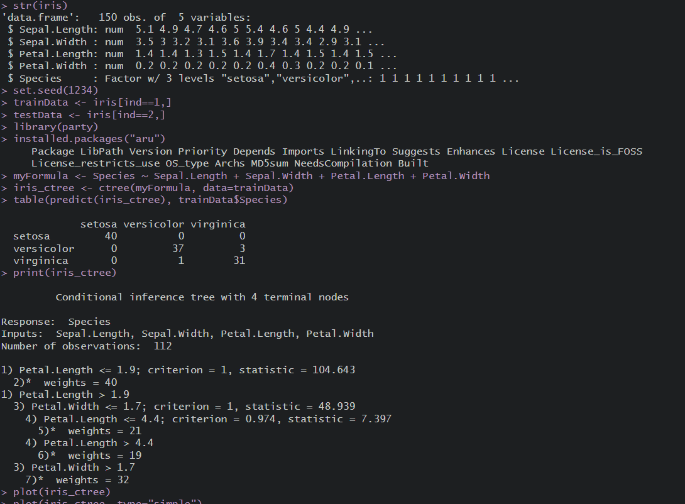
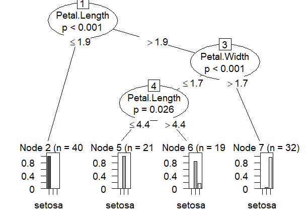
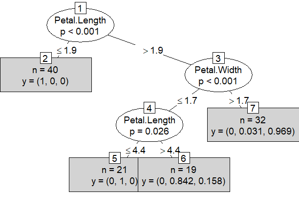

# DECISION TREE

## Pre-requirements :
 * Intall package named  *__party__*
## Code :

To view code [click here](./DECISION%20TREE.R)

## Algorithm :


```Algorithm
    step 1: Start the Process
    step 2: Install the iris dataset 
    step 3: Include here train and test data
    step 4: Install the package party
    step 5: Verify output.
    step 6: Stop the process
```

## Output :

### Console




### Plot Diagram





if the images didn't load then [click here](./output.png)

To view Plot Diagram click [1](./Rplot01.png) , [2](./Rplot02.png)