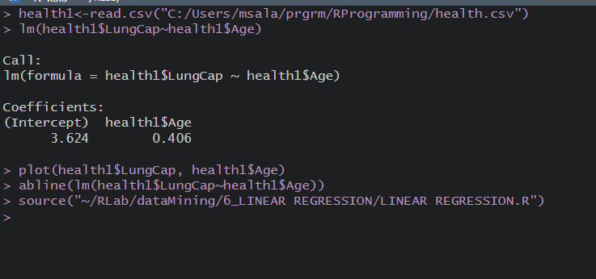
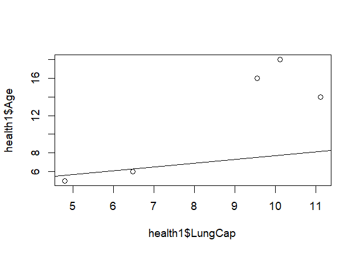

# LINEAR REGRESSION

## Pre-requirements :
 * Need the [health data file](./health.csv) before proceeding with  the execution.

## Code :

To view code [click here](./LINEAR%20REGRESSION.R)

## Algorithm :


```Algorithm
    step 1: Start the Process
    step 2: Read the health dataset
    step 3: Compare lungcapacity and age
    step 4: Make a code for abline
    step 5: Verify the output.
    step 6: Stop the process
```

## Output :

### Console




### Plot Diagram



if the images didn't load then [click here](./output.png)

To view Plot Diagram [click here](./Rplot.png)