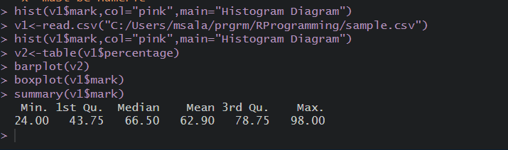
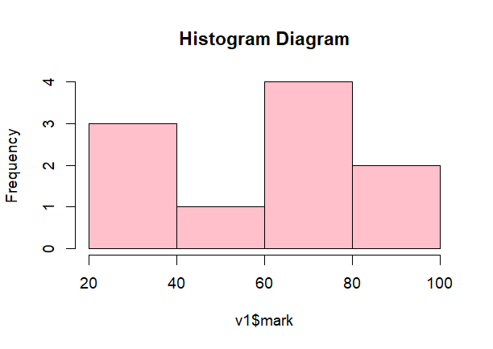
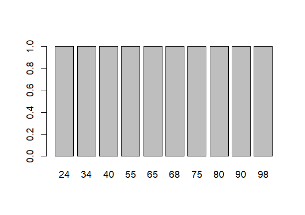
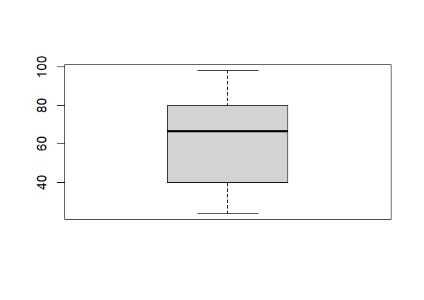

# DATA VISUALIZATION

## Pre-requirements :
 * Need the [sample data set](./sample.csv) before proceeding with  the execution.

## Code :

To view code [click here](./DATA%20VISUALIZATION.R)

## Algorithm :


```Algorithm
    step 1: Start the Process
    step 2: Read the sample dataset
    step 3: Display the Histogram Diagram
    step 4: Display the barplot and boxplot Diagram
    step 5: Verify the output.
    step 6: Stop the process
```

## Output :

### Console




### Plot Diagram





if the images didn't load [click here](./output.png) to view Console

To view Plot Diagram click [1](./Rplot01.png) , [2](./Rplot02.png) , [3](./Rplot03.png) ( click 1 ,2 then 3)  